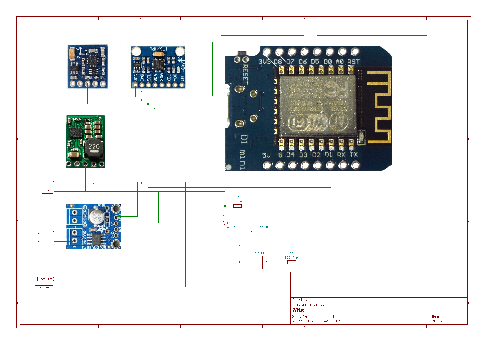

AutoSat (Satelite Dish Positioner) - code updated in 2026 with addional features like calibrate sensors and QMC5883P code adaption

many thanks to AK-Homberger for his previous code and electronic circuit which you could find here:
 
https://github.com/AK-Homberger/Satellite-Dish-Positioner

C++ (needed for stabil software diseqc puls generation)

 hardware:

 - esp8266 d1 mini (clones works too)
 - Diseqc rotor
 - Actuator (<=50mm)
 - gy-271 (with QMC5883P - not QMC5883L chipset)
 - gy-521 (gyro for vertical adjustment)
 - d24v10f5 (step down 24v to 5v)
 - Adafruit drv8871 (actuator control)
 - 1x 51ohm / 1x 100ohm resistor
 - 1x 3,3uF / 1x 56nF capasitors
 - 1x 1mH inductor
 
 - soldering station/knowledge
 - 

